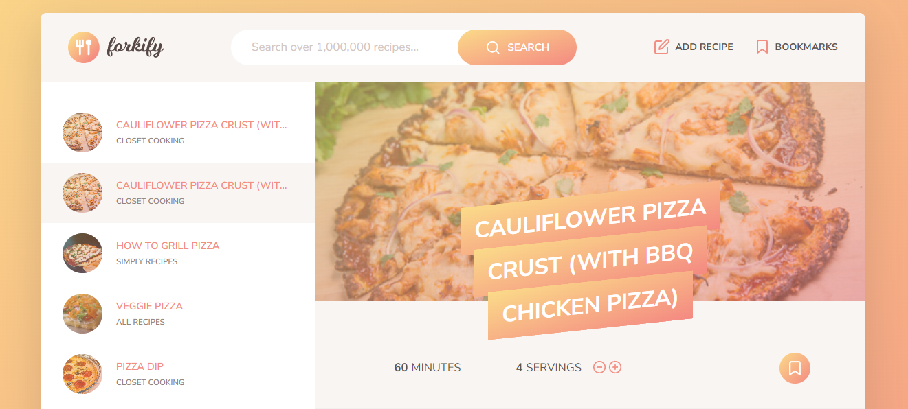

<h1 align="center">Forkify App</h1>
<p align="center">
    
 </p>

<p align="center">
  
  <a href="https://shander-forkify.netlify.app" target="_blank">
    
  </a>
  <a href="https://github.com/ShaAnder/forkify#readme" target="_blank">
    
  </a>
  <a href="https://github.com/ShaAnder/forkify/graphs/commit-activity" target="_blank">
    
  </a>
  <a href="https://github.com/ShaAnder/forkify/blob/main/LICENSE" target="_blank">
    
  </a>

</p>

<h2 align="center">
LIVE <a href="https://shander-forkify.netlify.app" target="_blank">Forkify App</a> can be found here.
</h2>
<p align="left">
Forkify is a recipe searching, tracking and uploading app, with it's main functions wholly dictated around being a user friendly way 
to save and track recipes for later use. The app uses advanced JavaScript concepts like asynchronous programming, ES6 modules, and object-oriented programming. Built with an MVC architecture and ease of use in mind this is the first major step toward building realworld function applications
Forkify was created by Jonas Schmedtmann and served as the last project of the The Complete JavaScript Course 2023, i built it for course completion and as a portfolio project.
</p>

## APP Features

This app utilizes several features that would typically be found in a recipe tracking app, we can:

- Search for recipes using keywords or ingredients
- Click on a recipe to view it's details, bookmark it and change servings ect
- Bookmark recipes and save them to local storage for future use
- Upload recipes to the api for later viewing
- Pagination to easily navigate multiple pages of results
- Utilizes a responsive design with multiple strategies implemented to optimize the code base

## Languages / Modules / APIs Used

- JavaScript
- CSS3
- HTML5
- Parcel
- NPM
- web history api
- local storage api

<p align="center">
  
</p>

## Flowchart

<p align="center">
  
</p>

## Installation Guide

First clone this repo

```sh
git clone https://github.com/ShaAnder/forkify.git
```

NPM install to get the dependancies

```sh
npm install
```

Use npm start to start the local server / test the app

```sh
npm start
```

## Summary

This summary section is pretty much a small snippet to summarize what I learnt about the project and how it's pushed me closer to being a full developer.

This app was first and foremost very fun to build, it showacased just how a real world app can be build and functions. As well as this it introduced several fundamental concepts that are nessecary to know for development.

Below we can see a list of summarized learning points and feel free to ask or dm me about them so i can go more into depth:

- Code refactoring and abstraction
- MVC architecture
- Distribution and pacakging of files
- Creation and use of properly designed JS workflow practices
- Subscriber-Publisher patterns
- Event propogation (throwing errors down chains)
- Package usage and how to use modules with Javascript

## TO DO

This project is not yet finished and there are several more improvements that could be implemented to make it even better, there is a slide in the flowcharts located at .src/img/flowcharts detailing improvements that could be added and these are planned next as well as attempting to create a user login system and get the app working on mobile.

## Author

ShaAnder [LinkedIn](https://www.linkedin.com/in/shaun-anderton-551670a9/) | [Twitter](https://twitter.com/ShaAnder10) | [Github](https://github.com/ShaAnder)

## Credits

This app was created as part of [Jonas Smechmann](https://twitter.com/jonasschmedtman)'s Udemy course [The Complete JavaScript Course 2023: From Zero to Expert!](https://www.udemy.com/course/the-complete-javascript-course/).

## License

This project is [MIT](https://github.com/ShaAnder/forkify/blob/main/LICENSE) licensed.
